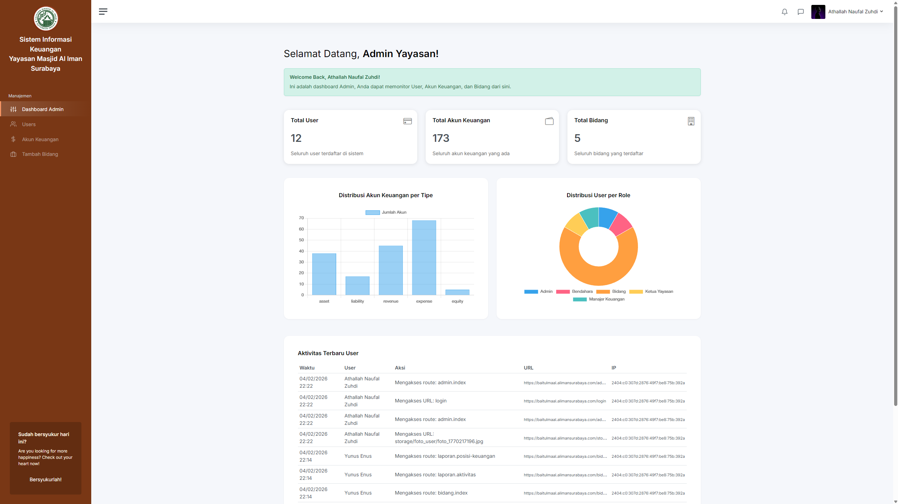
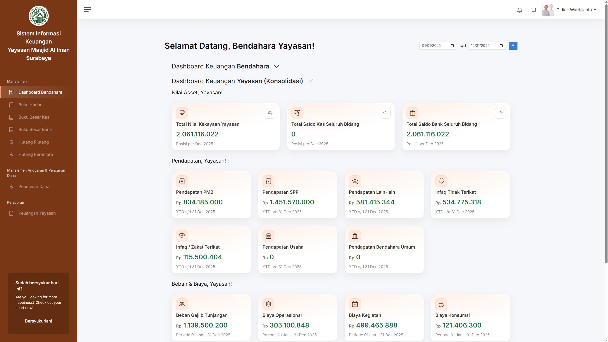
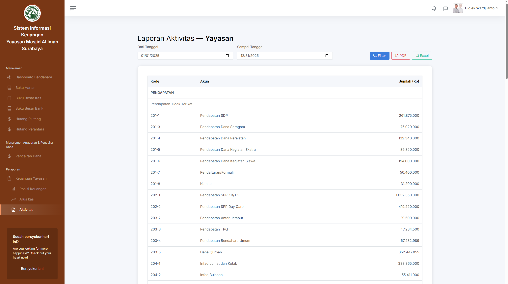
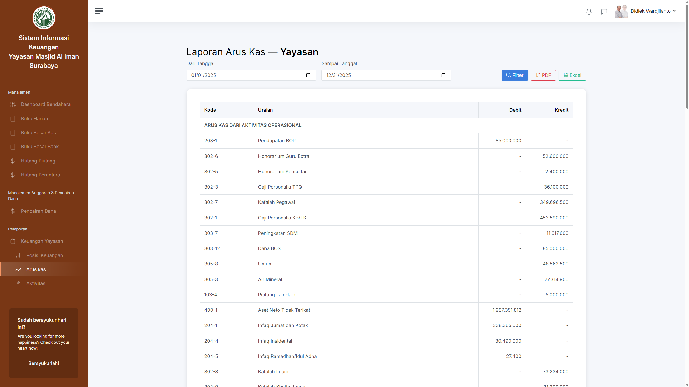

  

<h1 align="center">💰 Sistem Informasi Keuangan Baitul Maal</h1>
<h3 align="center">Yayasan Masjid Al Iman Surabaya</h3>

  Sistem digital terintegrasi untuk pencatatan, pengelolaan, dan pelaporan keuangan yayasan secara <b>akuntabel, transparan, dan sesuai PSAK</b>.

  
  
  
  
  

---

## ✨ Tentang Aplikasi

**Sistem Informasi Keuangan Baitul Maal** adalah aplikasi berbasis web yang dikembangkan untuk membantu yayasan dalam:

- Mengelola **infaq, shodaqoh, zakat, dan dana sosial**
- Mencatat transaksi secara **double-entry accounting**
- Menyajikan laporan keuangan **real-time & akurat**
- Mendukung transparansi kepada pengurus dan jamaah

Aplikasi ini dirancang khusus untuk **lembaga keagamaan & yayasan sosial**, dengan alur kerja yang sederhana namun sesuai standar akuntansi.

---

## 🎯 Tujuan Sistem

- ✅ Transparansi keuangan yayasan
- ✅ Akurasi pencatatan transaksi
- ✅ Kemudahan monitoring pemasukan & pengeluaran
- ✅ Kepatuhan terhadap prinsip akuntansi yayasan (PSAK 45)
- ✅ Digitalisasi administrasi keuangan

---

## 🚀 Fitur Utama

### 🔐 Manajemen Pengguna & Hak Akses
- Role-based access (Admin, Kasir, Sosial, dll)
- Pembatasan akses sesuai bidang

### 💵 Manajemen Transaksi
- Pencatatan pemasukan & pengeluaran
- Jurnal otomatis (debit & kredit)
- Penyesuaian & koreksi transaksi

### 📊 Laporan Keuangan
- Laporan pemasukan & pengeluaran
- Neraca keuangan yayasan
- Surplus / Defisit
- Riwayat transaksi lengkap

### 🧾 Infaq & Dana Sosial
- Tracking infaq per jamaah
- Riwayat pembayaran
- Monitoring status lunas / belum lunas

### 📄 Bukti & Arsip Digital
- Kwitansi digital
- Cetak laporan (PDF)
- Nomor transaksi otomatis

---

## 🧱 Teknologi yang Digunakan

| Komponen | Teknologi |
|--------|----------|
| Backend | Laravel 10 |
| Frontend | Blade + Bootstrap 5.3 |
| Database | MySQL / MariaDB |
| Auth | Laravel Authentication |
| UI | Responsive & Mobile Friendly |

---

## 📸 Preview Aplikasi

  
  

  
  

  

  

  

